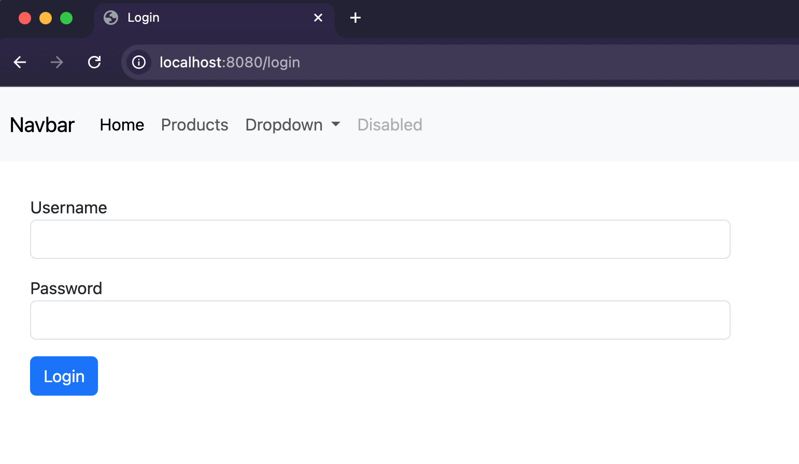
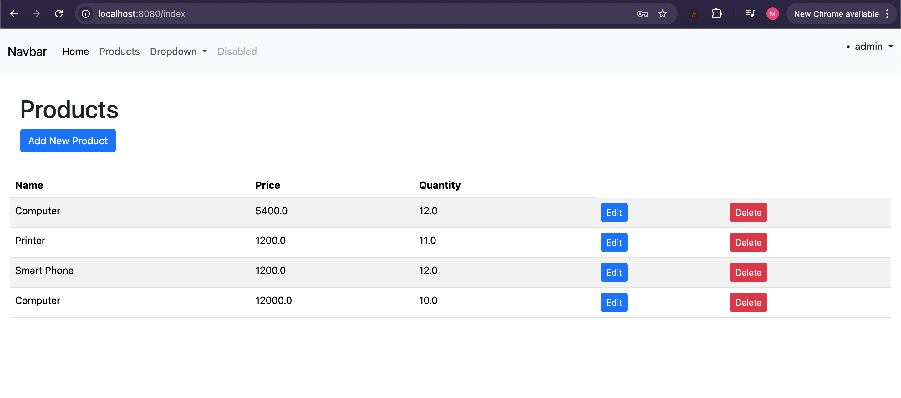
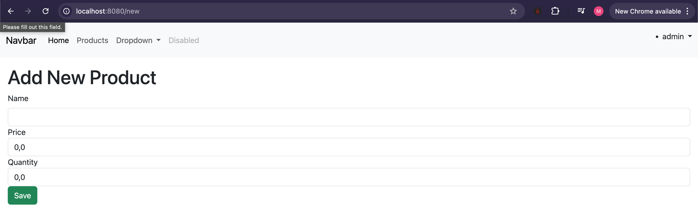

# TP JEE - Application Spring MVC
# Mohammed EL HIMAR | II-BDCC2

## 1. Presentation generale

Ce projet est une application web de gestion de produits developpee avec Spring Boot.
Elle permet de:

- S'authentifier
- Afficher la liste des produits
- Ajouter un produit
- Modifier un produit
- Supprimer un produit

Le projet suit une architecture MVC avec Thymeleaf pour la couche vue et Spring Data JPA pour l'acces aux donnees.

## 2. Modele de donnees

L'entite `Product` contient:

- `id` (Long, cle primaire auto-generee)
- `name` (String, obligatoire, taille 3 a 50)
- `price` (double, minimum 0)
- `quantity` (double, minimum 1)

Une insertion de donnees de depart est effectuee au demarrage via un `CommandLineRunner`.

## 3. Fonctionnalites implementees

### 3.1 Navigation et pages

- `/` redirige vers `/index`
- `/index` affiche la liste des produits
- `/new` affiche le formulaire d'ajout
- `/edit/{id}` affiche le formulaire de modification
- `/login` affiche la page de connexion
- `/403` affiche la page d'acces refuse

### 3.2 Operations metier

- Ajout/modification: route POST `/save`
- Suppression: route POST `/delete?id=...`
- Affichage: route GET `/index`

### 3.3 Validation

Validation Bean Validation sur les champs du produit.
En cas d'erreur, le formulaire est reaffiche avec messages d'erreur Thymeleaf.

## 4. Securite

La securite est geree par Spring Security avec authentification en memoire.

Comptes definis:

- `user1 / 1234` -> role USER
- `user2 / 1234` -> role USER
- `admin / 1234` -> roles USER, ADMIN

Regles d'acces:

- `/index/**` -> role USER
- `/new/**`, `/edit/**`, `/save/**`, `/delete/**` -> role ADMIN
- `/webjars/**` -> accessible sans authentification
- autres routes -> authentification requise

Remarque technique: CSRF est desactive dans la configuration actuelle.

## 5. Base de donnees et configuration

Configuration active:

- URL datasource: `jdbc:h2:mem:products-db`
- Utilisateur: `sa`
- Mot de passe: vide
- Console H2 activee: `spring.h2.console.enabled=true`
- Port serveur: `8080`

Le schema est maintenu avec `spring.jpa.hibernate.ddl-auto=update`.

## 6. Procedure d'execution

1. Ouvrir le projet
2. Lancer la commande suivante:

```bash
./mvnw spring-boot:run
```

3. Ouvrir le navigateur:

- Application: http://localhost:8080
- Connexion: http://localhost:8080/login
- Console H2: http://localhost:8080/h2-console

## 7. Captures d'ecran (a inserer)

### 7.1 Ecran de connexion




### 7.2 Liste des produits




### 7.3 Formulaire d'ajout/modification d'un produit




